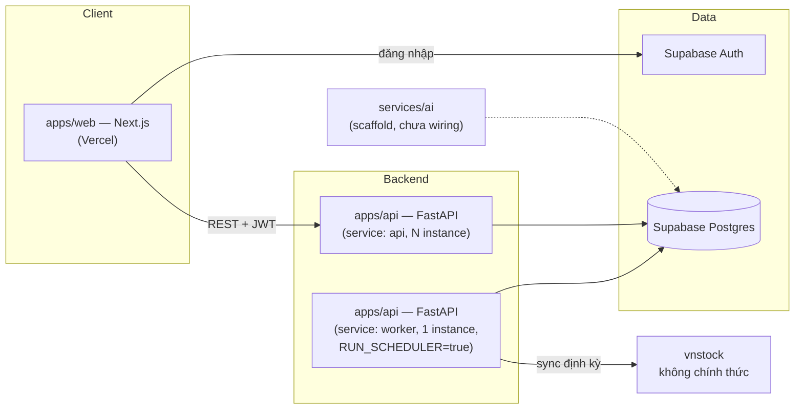

# Stock Intelligence Platform

Nền tảng thu thập, lưu trữ, phân tích và (tương lai) dự đoán dữ liệu
chứng khoán HOSE. Đây là bản viết lại hoàn toàn từ MVP ban đầu (giờ ở
`legacy/`), theo kiến trúc dài hạn: Next.js + FastAPI + Supabase Postgres.

## Kiến trúc



```
.
├── apps/
│   ├── api/            FastAPI + SQLAlchemy + Alembic — backend chính
│   └── web/              Next.js (App Router) + TypeScript + Tailwind — dashboard
├── services/
│   └── ai/                 AI Module — Random Forest đã cài đặt thật (chạy tay train.py/predict.py); XGBoost/LSTM còn scaffold
├── legacy/                   MVP cũ (SQLite + React/Vite) — đã đóng băng, chỉ để tham khảo
└── docker-compose.yml          Chạy cục bộ (Postgres local, không cần Supabase)
```

Chi tiết từng phần: [`apps/api/README.md`](apps/api/README.md),
[`apps/web/README.md`](apps/web/README.md), [`services/ai/README.md`](services/ai/README.md).

## Chạy nhanh cục bộ (không cần Supabase)

```bash
docker compose up --build
```

- Backend: http://localhost:8000/docs
- Frontend: http://localhost:3000

Dùng Postgres local (tự chạy migration khi container `api` khởi động),
không cần tạo Supabase project để xem giao diện/chạy thử API. **Lưu ý**:
theo cách này, RLS trên watchlist không thực sự được enforce (xem
`apps/api/README.md` mục "app_backend role") và Supabase Auth (đăng
nhập) sẽ không hoạt động nếu bạn không điền `NEXT_PUBLIC_SUPABASE_URL`/
`NEXT_PUBLIC_SUPABASE_ANON_KEY` — cần Supabase project thật cho phần đó.

## Chạy thủ công (không Docker)

```bash
# Terminal 1 — backend
cd apps/api
python3 -m venv venv && source venv/bin/activate
pip install -r requirements.txt
cp .env.example .env   # điền DATABASE_URL/DIRECT_URL — xem "Tạo Supabase project" bên dưới
alembic upgrade head
uvicorn app.main:app --reload --port 8000

# Terminal 2 — frontend
cd apps/web
npm install
cp .env.example .env.local
npm run dev
```

## Tạo Supabase project (bắt buộc để chạy thật)

1. Vào [supabase.com](https://supabase.com) → New Project. Ghi lại mật
   khẩu database bạn đặt lúc tạo (cần cho connection string).
2. **Lấy connection string** — Project Settings → Database → Connection
   string:
   - Chọn **Transaction pooler** (port 6543) → đây là `DATABASE_URL`.
   - Chọn **Session pooler** (port 5432, tương thích IPv4) → đây là
     `DIRECT_URL` (dùng cho Alembic). Không dùng "Direct connection"
     trừ khi máy/CI bạn chắc chắn có IPv6 — Supabase mặc định port
     5432 "direct" chỉ IPv6.
3. **Lấy API keys** — Project Settings → API: `Project URL` (→
   `SUPABASE_URL`/`NEXT_PUBLIC_SUPABASE_URL`), `anon public` key (→
   `NEXT_PUBLIC_SUPABASE_ANON_KEY`).
4. **Kiểm tra kiểu JWT** — Project Settings → Authentication → JWT Keys:
   nếu thấy "Legacy JWT Secret" là kiểu bạn đang dùng (HS256), copy vào
   `SUPABASE_JWT_SECRET`. Project mới thường ký bất đối xứng — để trống
   biến này, backend tự dùng JWKS.
5. Chạy migration: `cd apps/api && alembic upgrade head` (dùng
   `DIRECT_URL`, cấu hình tự động qua `alembic/env.py`).
6. **Đặt password cho role `app_backend`** (migration tự tạo role này
   nhưng KHÔNG đặt password — không để password trong version control):
   mở Supabase Dashboard → SQL Editor, chạy:
   ```sql
   ALTER ROLE app_backend WITH PASSWORD '<mật khẩu mạnh>';
   ```
   rồi dùng `app_backend`/mật khẩu đó trong `DATABASE_URL` (không phải
   `postgres` — xem giải thích trong `apps/api/README.md`, đây là điều
   kiện bắt buộc để RLS trên watchlist thực sự có tác dụng).
7. Bật Email auth (mặc định đã bật) ở Authentication → Providers nếu
   muốn test đăng nhập ngay, không cần cấu hình OAuth provider nào khác.

## Trạng thái từng module

| Module | Trạng thái |
|---|---|
| Data Collection — lịch sử giá qua vnstock | **Đã xác nhận với dữ liệu thật** — đồng bộ thành công 1306 dòng giá FPT qua backend deploy trên Render, kết nối Supabase Postgres thật |
| Data Collection — realtime price board | Đã port từ `legacy/realtime-poller`, đã test cấu trúc; chưa xác nhận với dữ liệu thật (chưa gọi tới trong quá trình deploy) |
| Data Collection — danh sách mã + đồng bộ hàng loạt | Đã có trang danh sách mã + nút đồng bộ 10 mã phổ biến (`POST /sync-defaults`), không cần gõ tìm thủ công |
| Data Collection — scheduler định kỳ | Đã cài đặt (APScheduler, advisory lock chống double-run, `data_sync_log`), đã test cục bộ; **`RUN_SCHEDULER=false`** trên backend đang deploy — chưa tự động sync hằng ngày, cần bật thêm service `worker` (xem mục Deploy) |
| Data Storage — schema Postgres, upsert chống trùng | Đã test đầy đủ trên Postgres thật (migration, composite index, upsert idempotent), đã chạy migration thật trên Supabase project của bạn |
| Data Storage — RLS watchlist | Đã cài đặt và test đúng bằng role `app_backend`; **deployment thật đang dùng role `postgres`** (theo lựa chọn của bạn) nên RLS chưa thực sự enforce ở đó — chỉ còn lớp kiểm tra ownership trong code |
| Data Processing — MA/EMA/RSI/MACD/Bollinger | Đã test trên Postgres thật, đã xác nhận đúng với dữ liệu FPT thật |
| Analysis Engine (chấm điểm xu hướng/thanh khoản/biến động) | **Đã triển khai thật** — tự tính lại mỗi lần sync, `GET /score` trả điểm thật; đã test trên Postgres local, dashboard hiển thị đúng |
| AI Module (Random Forest) | **Đã triển khai thật** — `services/ai/train.py` + `predict.py` chạy được end-to-end, ghi vào `ai_predictions`, `GET /prediction` đọc và trả về đúng; đã test trên Postgres local. **Cần bạn tự chạy `train.py`/`predict.py` trên dữ liệu Supabase thật** — chưa chạy tự động, chưa có trên deployment hiện tại. XGBoost/LSTM còn scaffold, xem `services/ai/README.md` |
| Dashboard — candlestick + chỉ báo + điểm chấm + AI prediction | Đã test bằng browser thật (Playwright) và trên deployment Vercel thật, render đúng với dữ liệu thật từ backend |
| Dashboard — tìm kiếm + danh sách mã | Đã test, hoạt động đúng trên deployment thật |
| Dashboard — watchlist + đăng nhập | Đã deploy thật (Vercel + Supabase Auth); cần xác nhận email trước khi đăng nhập lần đầu (Supabase mặc định bật "Confirm email") |

## Deploy

- **Frontend (Vercel)**: connect repo, root directory `apps/web`. Env
  vars: `NEXT_PUBLIC_API_BASE_URL` (URL backend đã deploy),
  `NEXT_PUBLIC_SUPABASE_URL`, `NEXT_PUBLIC_SUPABASE_ANON_KEY`.
- **Backend**: bất kỳ nền tảng nào chạy được Docker + process dài hạn
  (Render, Fly.io, Railway...) — KHÔNG dùng serverless thuần vì scheduler
  cần 1 process chạy liên tục. Ví dụ với Render:
  - Service `api`: build từ `apps/api/Dockerfile`, `RUN_SCHEDULER=false`,
    có thể scale nhiều instance.
  - Service `worker`: cùng image, `RUN_SCHEDULER=true`, **cố định đúng 1
    instance** (xem `apps/api/README.md` mục Scheduler để hiểu vì sao).
  - Cả 2 dùng chung `DATABASE_URL`/`DIRECT_URL` trỏ Supabase.
  - Chạy `alembic upgrade head` như Pre-Deploy Command (Render) hoặc
    `release_command` (Fly) — không chạy tay, dễ quên gây lệch schema.
  - Cập nhật `CORS_ALLOW_ORIGINS`/`CORS_ALLOW_ORIGIN_REGEX` ở backend
    thành domain Vercel thật trước khi public.

## Giới hạn đã biết

- `vnstock` là thư viện cộng đồng scrape dữ liệu VCI, không phải API
  chính thức của HOSE — không có SLA, đã từng đổi API giữa chừng dự án
  này (`source="TCBS"` bị loại bỏ). Mọi logic đặc thù của nó đã cô lập
  trong `apps/api/app/collectors/vnstock_adapter.py` để dễ thay thế.
- AI Module hiện chỉ có Random Forest; XGBoost/LSTM còn scaffold. Cả
  Analysis Engine lẫn AI Module chưa có job tự động — điểm chấm tự tính
  lại mỗi lần sync, nhưng dự đoán AI cần chạy tay `train.py`/`predict.py`
  (xem `services/ai/README.md`).
- Scheduler tự động sync hằng ngày chưa bật trên deployment thật
  (`RUN_SCHEDULER=false`) — cần thêm service `worker` riêng nếu muốn dữ
  liệu tự cập nhật (xem mục Deploy).
- RLS trên watchlist chưa thực sự enforce ở deployment thật (đang dùng
  role `postgres` thay vì `app_backend`) — chỉ còn lớp kiểm tra ownership
  ở code backend.

## Mã cũ (`legacy/`)

MVP đầu tiên (FastAPI + SQLite + React/Vite) — đã đóng băng, không phát
triển tiếp, giữ lại để tham khảo logic đã debug (đặc biệt là
`data_fetcher.py`/`poller.py`, đã port sang `vnstock_adapter.py`). Xem
`legacy/README.md`.
